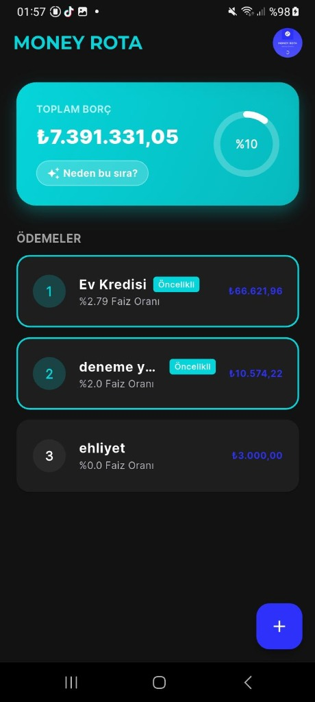
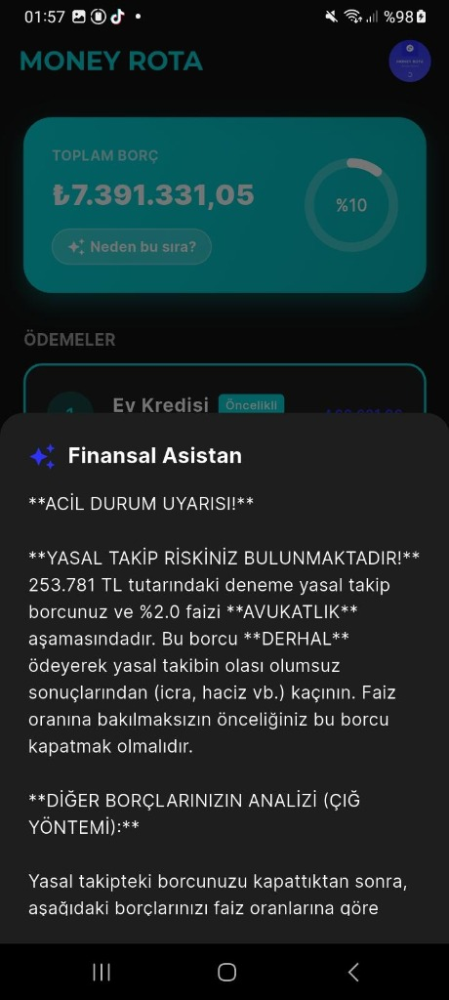
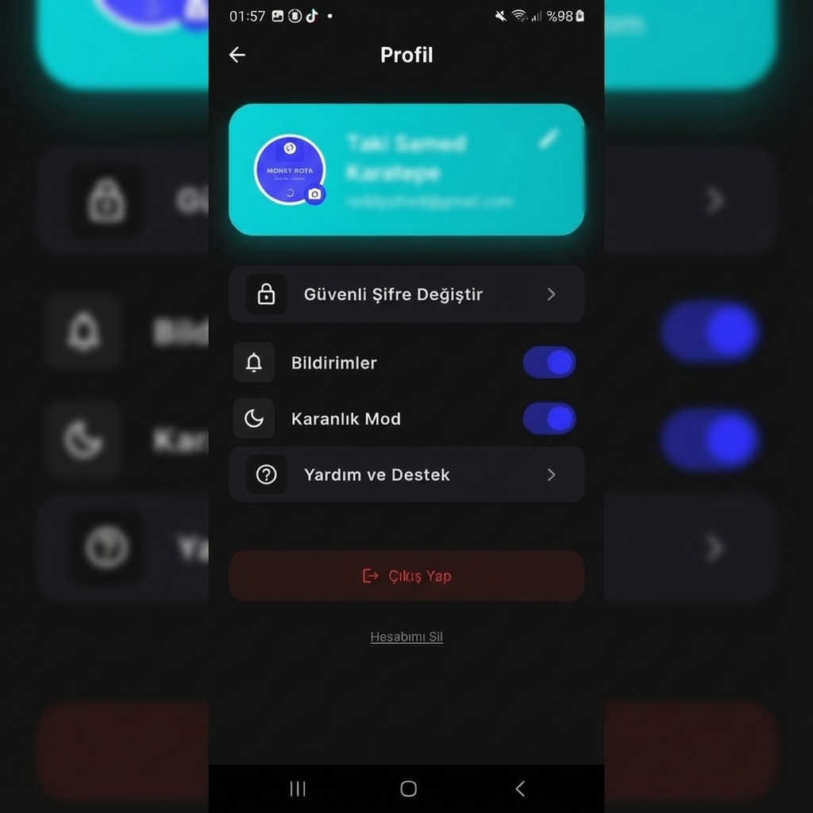

# 💸 Money Rota - Akıllı Borç Yönetim Asistanı


Money Rota, borçlarınızı takip etmenizi sağlayan, ödeme planları oluşturan ve **Yapay Zeka (Google Gemini)** desteğiyle size finansal tavsiyeler veren modern bir mobil uygulamadır.

## 🚀 Özellikler

- **🤖 Yapay Zeka Analizi:** Borçlarınızı "Çığ Yöntemi" (Yüksek faiz öncelikli) veya "Kartopu Yöntemi"ne göre analiz eder ve size özel ödeme stratejisi sunar.
- **💬 Akıllı Motivasyon:** Her taksit ödemesinde yapay zeka tarafından üretilen dinamik ve eğlenceli tebrik mesajları.
- **📊 Görsel Dashboard:** Toplam borç, ödenen miktar ve ilerleme durumunu gösteren grafiksel arayüz.
- **☁️ Bulut Senkronizasyon:** Firebase altyapısı sayesinde verileriniz güvenle saklanır ve kaybolmaz.
- **🔐 Güvenli Mimari:** API anahtarları `.env` yönetimi ile korunur.

## 🛠️ Kullanılan Teknolojiler

- **Frontend:** Flutter (Dart)
- **Backend / Database:** Firebase Firestore & Auth
- **AI Integration:** Google Generative AI SDK (Gemini 1.5 Flash Model)
- **State Management:** Native State Management
- **Design:** Modern UI/UX, Custom App Icons

## 📸 Ekran Görüntüleri

| Giriş Ekranı | Dashboard | AI Analizi | Profil |
| :---: | :---: | :---: | :---: |
|  |  |  |  |

## ⚙️ Kurulum ve Çalıştırma

Bu projeyi yerel ortamınızda çalıştırmak için aşağıdaki adımları izleyin:

1. **Projeyi Klonlayın:**
   ```bash
   git clone https://github.com/reddyoky/money_rota.git
   cd money_rota
   ```

2. **Bağımlılıkları Yükleyin:**
   ```bash
   flutter pub get
   ```

3. **Çevre Değişkenlerini Ayarlayın (.env):**
   Projenin ana dizininde `.env` dosyası oluşturun ve kendi Gemini API anahtarınızı ekleyin:
   ```env
   GEMINI_API_KEY=AIzaSy... (Sizin Anahtarınız)
   ```

4. **Uygulamayı Başlatın:**
   ```bash
   flutter run
   ```

---

*Bu proje Gazi Üniversitesi Bilgisayar Programcılığı Bölümü öğrencisi Taki Samed Karatepe tarafından geliştirilmiştir.*
